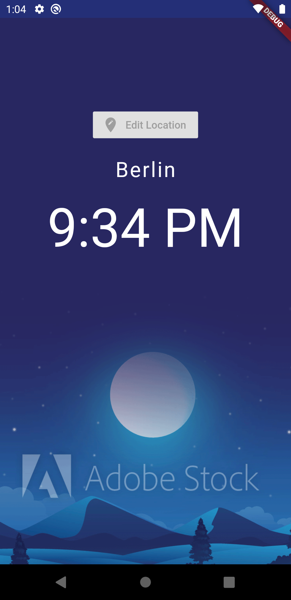
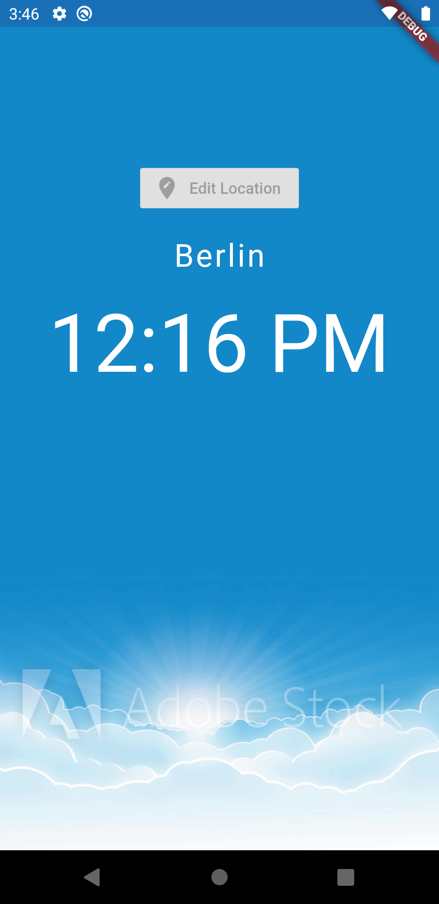
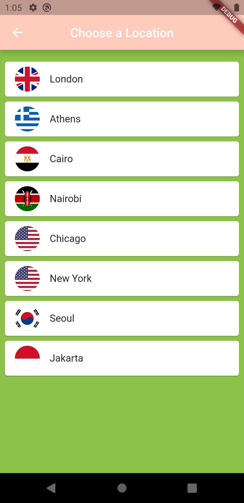

WorldClock_LearningFlutter!

I made this application when I was learning flutter. I have done API integration here. Picture in the homescreen is getting displayed according to the time i.e day or night. 

  
